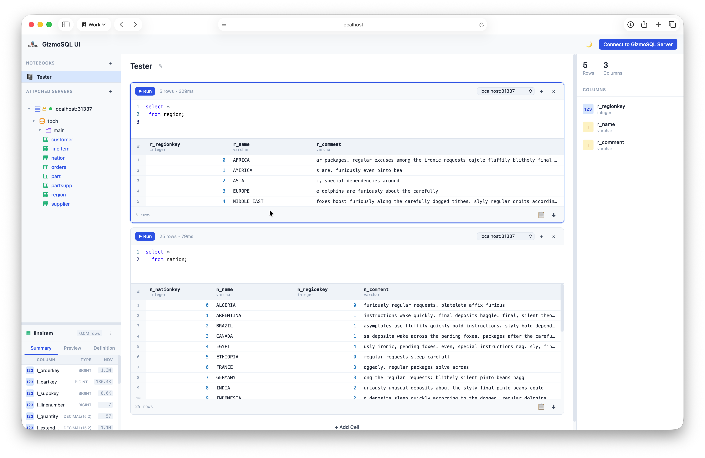

# GizmoSQL UI

A web-based SQL interface for [GizmoSQL](https://github.com/gizmodata/gizmosql) servers. GizmoSQL UI provides a modern, responsive interface for connecting to and querying GizmoSQL databases using Apache Arrow Flight SQL.



## Features

- **Connection Management**: Connect to GizmoSQL servers with support for TLS and authentication
- **SQL Editor**: Monaco-based SQL editor with syntax highlighting and autocomplete
- **Results Grid**: View query results in a responsive table with type-aware formatting
- **Schema Browser**: Browse catalogs, schemas, tables, and columns
- **Export Options**: Export results to CSV, TSV, JSON, or Parquet formats

## Quick Start

### macOS (Homebrew)

```bash
brew tap gizmodata/tap
brew trust gizmodata/tap  # required as of Homebrew 6.0
brew install gizmosql-ui
gizmosql-ui
```

### Windows (MSI Installer)

Download the installer for your architecture from the [releases page](https://github.com/gizmodata/gizmosql-ui/releases) and run it:
- `GizmoSQL-UI-x64.msi` — Intel/AMD (x64)
- `GizmoSQL-UI-arm64.msi` — Windows on ARM (arm64)

GizmoSQL UI will be available from:
- Desktop shortcut
- Start Menu → GizmoSQL UI
- Command line: `gizmosql-ui` (added to PATH)

### Using Pre-built Executable
The development server runs at http://localhost:3000

Download the appropriate executable for your platform from the [releases page](https://github.com/gizmodata/gizmosql-ui/releases), then run:
```bash
./gizmosql-ui
```

The UI will automatically open in your default browser at `http://localhost:3000`.

### Building from Source

#### Prerequisites

- Node.js 24+
- pnpm 9+

#### Development

```bash
# Install dependencies
pnpm install

# Run in development mode
pnpm dev
```

The development server runs at http://localhost:3000

#### Production Build

```bash
# Build for production
pnpm build

# Start the production server
pnpm start
```

#### Creating Standalone Executables

You can package the app into standalone executables for Linux, macOS, and Windows:

```bash
# Build executables for all platforms
pnpm package
```

The executables will be created in `dist/`. Run them directly:

```bash
./dist/gizmosql-ui-macos-arm64   # macOS
./dist/gizmosql-ui-linux-x64     # Linux
dist\gizmosql-ui-win-x64.exe     # Windows
```

The executable will start the server and automatically open your browser to `http://localhost:3000`.

### Starting a GizmoSQL Server (Optional)

If you don't have a GizmoSQL server running, you can start one using Docker.  Note that we use INIT_SQL_COMMANDS to generate some TPC-H tables (and data) for the demo:

```bash
docker run --name gizmosql \
           --detach \
           --rm \
           --tty \
           --init \
           --publish 31337:31337 \
           --env TLS_ENABLED="1" \
           --env GIZMOSQL_USERNAME="gizmosql_user" \
           --env GIZMOSQL_PASSWORD="gizmosql_password" \
           --env PRINT_QUERIES="1" \
           --env INIT_SQL_COMMANDS="CALL dbgen(sf=0.01);" \
           --pull always \
           gizmodata/gizmosql:latest
```

Then connect GizmoSQL UI using:
- Host: `localhost`
- Port: `31337`
- Username: `gizmosql_user`
- Password: `gizmosql_password`
- Use TLS: enabled
- Skip TLS Verify: enabled (for self-signed certificate)

## Configuration

### Connection Parameters

| Parameter | Description | Default |
|-----------|-------------|---------|
| Host | GizmoSQL server hostname or IP | localhost |
| Port | GizmoSQL server port | 31337 |
| Username | Authentication username | (required) |
| Password | Authentication password | (required) |
| Use TLS | Enable TLS encryption | true |
| Skip TLS Verify | Skip TLS certificate verification | false |

### Environment Variables

| Variable | Description | Default |
|----------|-------------|---------|
| PORT | HTTP server port | 3000 |
| GIZMOSQL_OTEL_TRACES_EXPORTER | Enables driver tracing: `none`, `otlp`, `console`, or `adbcfile` | none |
| GIZMOSQL_OTEL_TRACES_FOLDER_PATH | Output directory for the `adbcfile` exporter | — |
| GIZMOSQL_OTEL_TRACE_PARENT | W3C `traceparent` to join an existing distributed trace | — |
| ADBC_DRIVER_FLIGHTSQL_LOG_LEVEL | Structured driver log level: `debug`, `info`, `warn`, `error` | — |
| OTEL_EXPORTER_OTLP_ENDPOINT | Collector endpoint, used when `GIZMOSQL_OTEL_TRACES_EXPORTER=otlp` | — |
| OTEL_EXPORTER_OTLP_PROTOCOL | OTLP wire protocol — use `http/protobuf` (see note below) | — |

### Enabling Driver Tracing (for Support/Diagnostics)

GizmoSQL UI connects through the native GizmoSQL ADBC driver, which can emit
OpenTelemetry trace spans for every query lifecycle stage (`Database.Open`,
`Prepare`, `ExecuteQuery`, `ExecuteUpdate`). This is off by default and is
controlled entirely by environment variables set on the GizmoSQL UI process
— there is nothing to configure in the browser UI.

**Option 1 — print traces to the terminal (quickest way to check it works):**

```bash
GIZMOSQL_OTEL_TRACES_EXPORTER=console pnpm start
```

Run a query in the UI and you'll see JSON span output in the terminal
GizmoSQL UI is running in.

**Option 2 — send traces to an OpenTelemetry collector:**

```bash
GIZMOSQL_OTEL_TRACES_EXPORTER=otlp \
OTEL_EXPORTER_OTLP_ENDPOINT=http://localhost:4318 \
OTEL_EXPORTER_OTLP_PROTOCOL=http/protobuf \
pnpm start
```

> **Note:** use `http/protobuf`, not `grpc`. The `grpc` protocol failed to
> connect to a standard OTel Collector in testing; `http/protobuf` against
> the collector's OTLP/HTTP port (`4318` by default) works reliably.

**Option 3 — write traces to local files** (useful for collecting a support
bundle without standing up a collector):

```bash
GIZMOSQL_OTEL_TRACES_EXPORTER=adbcfile \
GIZMOSQL_OTEL_TRACES_FOLDER_PATH=/tmp/gizmosql-traces \
pnpm start
```

**Driver debug logs**, independent of tracing, are enabled the same way:

```bash
ADBC_DRIVER_FLIGHTSQL_LOG_LEVEL=debug pnpm start
```

### Trying It Yourself: Full Local Test Setup

These steps reproduce a complete tracing setup on your own machine — a test
GizmoSQL server, a local OTel collector to receive traces, and GizmoSQL UI
with tracing turned on. Requires [Docker](https://www.docker.com/) and this
repo checked out locally.

**1. Start a test GizmoSQL server** (same one used in
[Starting a GizmoSQL Server](#starting-a-gizmosql-server-optional) above):

```bash
docker run --name gizmosql \
           --detach \
           --rm \
           --tty \
           --init \
           --publish 31337:31337 \
           --env TLS_ENABLED="1" \
           --env GIZMOSQL_USERNAME="gizmosql_user" \
           --env GIZMOSQL_PASSWORD="gizmosql_password" \
           --env PRINT_QUERIES="1" \
           --env INIT_SQL_COMMANDS="CALL dbgen(sf=0.01);" \
           --pull always \
           gizmodata/gizmosql:latest
```

**2. Create a minimal OTel collector config** that just prints received
traces to its own log:

```bash
cat > /tmp/otel-collector-config.yaml <<'EOF'
receivers:
  otlp:
    protocols:
      grpc:
        endpoint: 0.0.0.0:4317
      http:
        endpoint: 0.0.0.0:4318

exporters:
  debug:
    verbosity: detailed

service:
  pipelines:
    traces:
      receivers: [otlp]
      exporters: [debug]
EOF
```

**3. Start the collector**, mounting that config in:

```bash
docker run --name otel-collector \
           --detach \
           --rm \
           --publish 4317:4317 \
           --publish 4318:4318 \
           --volume /tmp/otel-collector-config.yaml:/etc/otelcol/config.yaml \
           --pull always \
           otel/opentelemetry-collector:latest \
           --config=/etc/otelcol/config.yaml
```

**4. Start GizmoSQL UI with tracing pointed at the collector:**

```bash
pnpm install   # first time only

GIZMOSQL_OTEL_TRACES_EXPORTER=otlp \
OTEL_EXPORTER_OTLP_ENDPOINT=http://localhost:4318 \
OTEL_EXPORTER_OTLP_PROTOCOL=http/protobuf \
pnpm dev
```

> `pnpm dev` is the quickest way to try this since it skips the build step.
> `pnpm build && pnpm start` (the production standalone server) works too.

**5. Reproduce a trace:** open `http://localhost:3000`, connect using the
credentials from step 1 (Host `localhost`, Port `31337`, Username
`gizmosql_user`, Password `gizmosql_password`, Use TLS enabled, Skip TLS
Verify enabled), and run any query (e.g. `SELECT count(*) FROM orders`).

**6. Confirm the trace arrived** by tailing the collector's log — you should
see `Database.Open` and `ExecuteQuery` spans appear within a few seconds of
running the query:

```bash
docker logs -f otel-collector
```

**7. Clean up** when you're done:

```bash
docker stop gizmosql otel-collector
```

Same variables apply when running a packaged executable
(`./dist/gizmosql-ui-macos-arm64`, etc.) — just set them before launching it.

## Architecture

```
┌──────────────────────────────────────────────────┐
│  GizmoSQL UI (Next.js)                           │
├──────────────────────────────────────────────────┤
│  React Frontend (App Router)                     │
│  ├── Monaco SQL Editor                           │
│  ├── Results Grid                                │
│  └── Schema Browser                              │
├──────────────────────────────────────────────────┤
│  Next.js API Routes                              │
│  ├── /api/* endpoints                            │
│  └── @gizmodata/gizmosql-client                  │
└──────────────────────────────────────────────────┘
                        │
                        │ gRPC (Arrow Flight SQL)
                        ▼
┌──────────────────────────────────────────────────┐
│  GizmoSQL Server                                 │
└──────────────────────────────────────────────────┘
```

## Project Structure

```
gizmosql-ui/
├── app/                    # Next.js App Router
│   ├── api/               # API routes
│   │   ├── catalogs/
│   │   ├── columns/
│   │   ├── connect/
│   │   ├── disconnect/
│   │   ├── health/
│   │   ├── query/
│   │   ├── schemas/
│   │   └── tables/
│   ├── layout.tsx         # Root layout
│   └── page.tsx           # Main page
├── components/            # React components
├── context/              # React context providers
├── lib/                  # Utilities and services
│   ├── api.ts           # Frontend API client
│   ├── connections.ts   # Server connection manager
│   ├── services/        # Backend services
│   └── types.ts         # TypeScript types
└── public/              # Static assets
```

## API Endpoints

| Endpoint | Method | Description |
|----------|--------|-------------|
| /api/health | GET | Health check |
| /api/connect | POST | Connect to GizmoSQL server |
| /api/disconnect | POST | Disconnect from server |
| /api/query | POST | Execute SQL query |
| /api/catalogs | GET | List catalogs |
| /api/schemas | GET | List schemas |
| /api/tables | GET | List tables |
| /api/columns | GET | List columns |

## License

Apache License 2.0

## Credits

Developed by [GizmoData LLC](https://gizmodata.com)

Powered by:
- [Next.js](https://nextjs.org/) - React framework
- [@gizmodata/gizmosql-client](https://www.npmjs.com/package/@gizmodata/gizmosql-client) - GizmoSQL client library
- [Monaco Editor](https://microsoft.github.io/monaco-editor/) - Code editor
- [Apache Arrow](https://arrow.apache.org/) - Columnar data format
